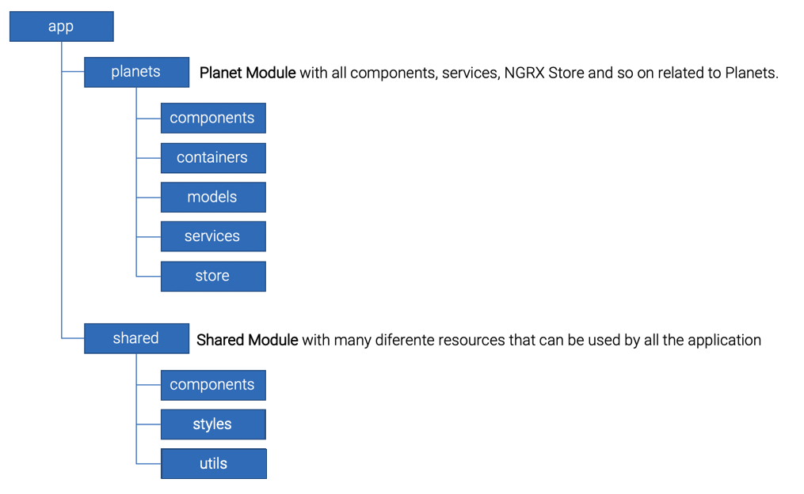

# Star Wars Planet Quiz Game

This is a simple project to explore a lot of the features from **Angular**, **Angular FlexLayout**, and **HTML/CSS**. Furthermore, the app was developed with reactive programming using **NGRX**, **RxJS** and **Observables**.

I did not use any front-end framework, such as **Angular Material**, **Ionic**, **Bootstrap** and so on. I decided to use just the good and old **CSS** to create all the style of the application. Thereby, I can show my knowledge of how to create UIs without any framework.

I also used **@media screen** to make the UI responsible and to have some differences in Mobile screens.

Want to see it in action? **[Click here](https://star-wars-planet-quiz-game.firebaseapp.com/)**

# Application structure

Bellow is an overview of how the application was structured. In summary, it has two modules. One of them has shared resources and the other with the planet feature.

# About the development workflow

### How to server?

Run `ng serve` for a dev server. Navigate to `http://localhost:4200/`. The app will automatically reload if you change any of the source files.

### How to Build?

Run `ng build` to build the project. The build artifacts will be stored in the `dist/` directory. Use the `--prod` flag for a production build.

### How to run unit tests?

Run `ng test` to execute the unit tests via [Karma](https://karma-runner.github.io).

### How to run end-to-end tests?

Run `ng e2e` to execute the end-to-end tests via [Protractor](http://www.protractortest.org/).
